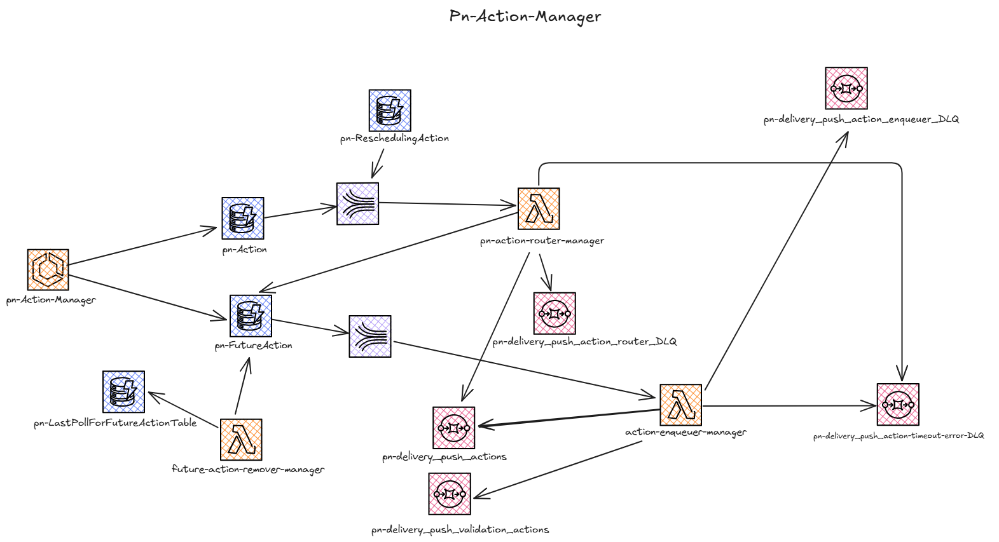

# pn-action-manager
Repository per la gestione delle action

## Panoramica
Si compone di:

- AWS **Lambda**:
    - **pn-action-router-manager**: gestisce eventi provenienti da uno stream Kinesis alimentato dagli eventi di inserimento di record dalla tabella `pn-Action`, processando ciascun record per decidere se inviarlo immediatamente a una coda SQS oppure inserire il record nella tabella `pn-FutureAction`. Restituisce in risposta un array contenente gli identificativi dei record dove in caso è stata riscontrata un'eccezione.
    - **action-enqueuer-manager**: riceve eventi da uno stream Kinesis alimentato dagli eventi di rimozione di record dalla tabella `pn-FutureAction` , per ciascuno, determina la coda SQS di destinazione in base al tipo di action. Raggruppa le action per destinazione e le invia in batch alla relativa coda SQS. Scarta le action con il campo logicalDeleted a true. Restituisce in risposta un array contenente gli identificativi dei record in caso è stata riscontrata un'eccezione.
    - **future-action-remover-manager**: eseguita ogni minuto tramite regola EventBridge, elimina in batch dalla tabella `pn-FutureAction` tutte le action nei timeslot scaduti. Aggiorna il riferimento al timeslot lavorato nella tabella `pn-LastPollForFutureAction` solo se tutte le eliminazioni vanno a buon fine.
- Microservice Spring Boot 3
  - **pn-action-manager**: espone due API per la gestione delle action. La prima API consente l'inserimento di un nuovo record nella tabella Action, mentre la seconda API, operando sulla tabella futureAction, permette di annullare l'azione programmata associata a uno specifico slot temporale.

### Architettura

https://excalidraw.com/#json=64HdbyzbKFlgq_RFe6jC9,9fCK45IQfvKxcMsE3hPeVA
## Componenti

### pn-action-manager

#### Responsabilità
- Legge e scrive sulla tabella DynamoDB: `ActionDynamoTableName`
- Scrive sulla tabella DynamoDB: `FutureActionDynamoTableName`

#### Configurazione
| Variabile Ambiente            | Descrizione                                                            | Obbligatorio | Default |
|-------------------------------|------------------------------------------------------------------------|--------------|---------|
| `AWS_REGIONCODE`              | Regione AWS                                                            | Si           | -       |
| `FutureActionDynamoTableName` | Nome della tabella dynamodb contenente la gestione delle future action | Si           | -       |
| `ActionDynamoTableName`       | Nome della tabella dynamodb contenente la gestione delle action        | Si           | -       |
| `PN_CRON_ANALYZER`            | Cron l'invio della metrica a CloudWatch                                | -            | -       |
| ` WIRE_TAP_LOG`               | Attivazione dei wire logs                                              | -            | -       |

## action-enqueuer-manager
### Responsabilità
- Raggruppamento delle action per destinazione SQS in base al tipo di action
- Invio in batch delle action alle relative code SQS (endpoint determinato dinamicamente)
- Scarto delle action con il campo `logicalDeleted` a `true`
- Restituisce in risposta un array contenente gli identificativi dei record non lavorati correttamente dove è stata riscontrata un'eccezione.

### Configurazione
| Variabile Ambiente          | Descrizione                                                             | Obbligatorio | Default          |
|-----------------------------|-------------------------------------------------------------------------|--------------|------------------|
| `AWS_REGIONCODE`            | Regione AWS                                                             | Sì           |                  |
| `QueueUrlMap`               | Nome della variabile d'ambiente contenente la mappa degli endpoint SQS  | Sì           | QUEUE_URL_MAP    |
| `ActionQueueMap`            | Nome della variabile d'ambiente contenente la mappa tipo action -> coda | Sì           | ACTION_QUEUE_MAP |
| `ActionTimeoutErrorDLQURL`  | Endpoint della DLQ per i timeout                                        | Sì           | -                |
| `RUN_TOLLERANCE_IN_MILLIS`  | Tolleranza in millisecondi per la chiusura anticipata della lambda      | Sì           | 3000             |
| `MAX_EVENT_BRIDGE_BATCH`    | Dimensione massima del batch per l’invio all'eventBridge                | Si           | 1                |
| `ActionLambdasEnabledStart` | Data/ora di inizio finestra di lavoro                                   | -            | 2024-05-10T12:00 |
| `ActionLambdasEnabledEnd `  | Data/ora di fine finestra di lavoro                                     | -            | 2099-05-30T12:00 |

N.B. L'elaborazione delle action viene presa in carico solo se il campo `createdAt` rientra nell’intervallo temporale compreso tra `ActionLambdasEnabledStart` ed `ActionLambdasEnabledEnd`.

## future-action-remover-manager
### Responsabilità
- Esecuzione periodica (previsto ogni minuto) tramite Lambda
- Lettura delle action dalla tabella DynamoDB `pn-FutureAction` con timeslot scaduto rispetto alla finestra di lavoro
- Eliminazione in batch delle action scadute dalla tabella `pn-FutureAction`
- Aggiornamento della tabella `pn-LastPollForFutureActionTable` con il riferimento all’ultimo timeslot lavorato, solo se tutte le eliminazioni sono andate a buon fine
- Gestione della tolleranza di chiusura anticipata e del retry per elementi non processati

### Configurazione
| Variabile Ambiente             | Descrizione                                                        | Obbligatorio | Default                         |
|--------------------------------|--------------------------------------------------------------------|--------------|---------------------------------|
| `FutureActionDynamoTableName`  | Nome della tabella DynamoDB contenente le future action            | Sì           | pn-FutureAction                 |
| `LAST_POLL_TABLE_NAME`         | Nome della tabella DynamoDB per il tracking dell’ultimo polling    | Sì           | pn-LastPollForFutureActionTable |
| `MAX_BATCH_SIZE`               | Dimensione massima del batch per l’eliminazione                    | Si           | 25                              |
| `LAST_WORKED_KEY`              | Chiave per il tracking dell’ultimo timeslot lavorato               | Si           | 3                               |
| `TOLLERANCE_IN_MILLIS`         | Tolleranza in millisecondi per la chiusura anticipata della lambda | -            | 3000                            |
| `ActionLambdasEnabledStart`    | Data/ora di inizio finestra di lavoro                              | -            | 2030-04-30T12:00                |
| `ActionLambdasEnabledEnd`      | Data/ora di fine finestra di lavoro                                | -            | 2099-04-30T12:00                |
| `SLEEP_FOR_UNPROCESSED`        | Millisecondi di attesa per retry su elementi non processati        | -            | 1000                            |

N.B. L'elaborazione delle action viene presa in carico solo se il campo `createdAt` rientra nell’intervallo temporale compreso tra `ActionLambdasEnabledStart` ed `ActionLambdasEnabledEnd`.

## pn-action-router-manager
### Responsabilità
- Gestione degli eventi provenienti da uno stream Kinesis
- Per ogni record, verifica se l’azione deve essere inviata subito a una coda SQS o inserita nella tabella `pn-FutureAction`
- Invio in batch delle azioni immediate alle relative code SQS (endpoint determinato dinamicamente)
- Inserimento delle future action nella tabella DynamoDB `pn-FutureAction`
- Restituisce in risposta un array contenente gli identificativi dei record non lavorati correttamente dove è stata riscontrata un'eccezione.

### Configurazione
| Variabile Ambiente             | Descrizione                                                                 | Obbligatorio | Default                       |
|--------------------------------|-----------------------------------------------------------------------------|--------------|-------------------------------|
| `AWS_REGIONCODE`               | Regione AWS                                                                 | Sì           |                               |
| `QueueUrlMap`                  | Nome della variabile d'ambiente contenente la mappa degli endpoint SQS      | Sì           | QUEUE_URL_MAP                 |
| `ActionQueueMap`               | Nome della variabile d'ambiente contenente la mappa tipo action -> coda     | Sì           | ACTION_QUEUE_MAP              |
| `FutureActionDynamoTableName`  | Nome della tabella DynamoDB per le future action                            | Sì           | pn-FutureAction               |
| `MAX_SQS_BATCH_SIZE`           | Dimensione massima del batch per l’invio alle code SQS                      | Si           | 1                             |
| `MAX_DYNAMO_BATCH`             | Dimensione massima del batch per l’inserimento su DynamoDB                  | Si           | 1                             |
| `RUN_TOLLERANCE_IN_MILLIS`     | Tolleranza in millisecondi per la chiusura anticipata della lambda          | -            | 3000                          |
| `ACTION_TIMEOUT_ERROR_DLQ_URL` | Endpoint della DLQ per errori di timeout                                    | Si           | ACTION_TIMEOUT_ERROR_DLQ_URL  |
| `ActionLambdasEnabledStart`    | Data/ora di inizio finestra di lavoro                                       | -            | 2024-05-10T12:00              |
| `ActionLambdasEnabledEnd`      | Data/ora di fine finestra di lavoro                                         | -            | 2099-05-30T12:00              |

N.B. L'elaborazione delle action viene presa in carico solo se il campo `createdAt` rientra nell’intervallo temporale compreso tra `ActionLambdasEnabledStart` ed `ActionLambdasEnabledEnd`.
## Testing in locale

### Prerequisiti
1. JDK 21 installato in locale
2. Docker avviato con container di Localstack (puoi utilizzare il Docker Compose presente nel repository).

I dettagli sui test di integrazione e le procedure di testing sono disponibili in [README.md](./test/resources/README.md)