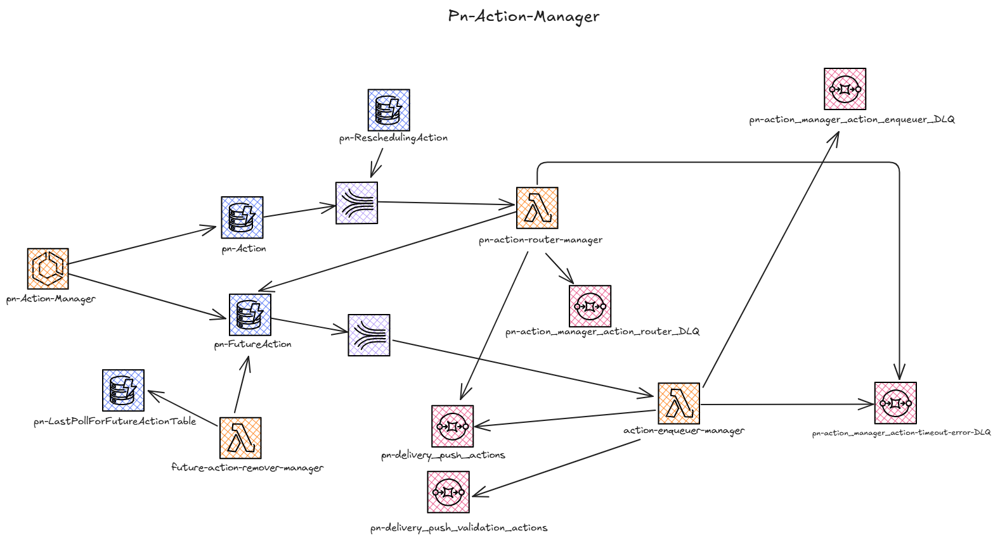

# pn-action-manager
Repository per la gestione delle action

## Panoramica
Si compone di:

- AWS **Lambda**:
    - **action-enqueuer-manager**: riceve eventi da uno stream Kinesis alimentato dagli eventi di rimozione di record dalla tabella `pn-FutureAction` , per ciascuno, determina la coda SQS di destinazione in base al tipo di action. Raggruppa le action per destinazione e le invia in batch alla relativa coda SQS. Scarta le action fuori timeSlot o con il campo logicalDeleted a true. Restituisce a Kinesis l’elenco dei record non inviati correttamente.
    - **future-action-remover-manager**: eseguita ogni minuto tramite regola EventBridge, elimina in batch dalla tabella `pn-FutureAction` tutte le action nei timeslot scaduti. Aggiorna il riferimento al timeslot lavorato nella tabella `pn-LastPollForFutureAction` solo se tutte le eliminazioni vanno a buon fine.
    - **pn-action-router-manager**: gestisce eventi provenienti da uno stream Kinesis alimentato dagli eventi di inserimento di record dalla tabella `pn-Action`, processando ciascun record per decidere se inviarlo immediatamente a una coda SQS oppure inserire il record nella tabella `pn-FutureAction`.
- Microservizio Spring Boot 3
  - **pn-action-manager**: espone due API per la gestione delle action. La prima API consente l'inserimento di un nuovo record nella tabella Action, mentre la seconda API, operando sulla tabella futureAction, permette di annullare l'azione programmata associata a uno specifico slot temporale.

### Architettura

https://excalidraw.com/#json=7xYGxbjhSpZYUkPSshl5e,FZCEPwigDlHx_icozTQx1g
## Componenti

### pn-action-manager

#### Responsabilità
- Legge e scrive sulla tabella DynamoDB: `pn-Action`
- Scrive sulla tabella DynamoDB: `pn-FutureAction`

#### Configurazione
| Variabile Ambiente | Descrizione                                     | Default     | Obbligatorio   |
|--------------------|-------------------------------------------------|-------------|----------------|
| AWS_REGIONCODE        | N&#x2F;A                                        | -           | Si  |
| PN_ACTIONMANAGER_FUTUREACTIONDAO_TABLENAME        | Name of dynamodb table containing               | -           | Si  |
| PN_ACTIONMANAGER_ACTIONDAO_TABLENAME        | Name of dynamodb table containing               | -           | Si  |
| PN_CRON_ANALYZER        | Cron for which you send the metric to CloudWatch | -           | No  |
| WIRE_TAP_LOG        | Activation of wire logs                         | -           | No  |

## action-enqueuer-manager
### Responsabilità
- Raggruppamento delle action per destinazione SQS in base al tipo di action
- Invio in batch delle action alle relative code SQS (endpoint determinato dinamicamente)
- Scarto delle action fuori dal timeSlot di lavoro o con il campo `logicalDeleted` a `true`
- Restituzione a Kinesis dell’elenco dei record non inviati correttamente

### Configurazione
| Variabile Ambiente                  | Descrizione                                                                 | Obbligatorio | Default         |
|-------------------------------------|-----------------------------------------------------------------------------|--------------|-----------------|
| `AWS_REGIONCODE`                    | Regione AWS                                                                 | Sì           |                 |
| `QUEUE_ENDPOINTS_ENV_VARIABLE`      | Nome della variabile d'ambiente contenente la mappa degli endpoint SQS      | Sì           | QUEUE_URL_MAP   |
| `ACTION_MAP_ENV_VARIABLE`           | Nome della variabile d'ambiente contenente la mappa tipo action -> coda     | Sì           | ACTION_QUEUE_MAP|
| `TIMEOUT_DLQ`                       | Endpoint della DLQ per i timeout                                            | Sì           | http://test     |
| `RUN_TOLLERANCE_IN_MILLIS`          | Tolleranza in millisecondi per la chiusura anticipata della lambda          | Sì           | 3000            |
| `MAX_SQS_BATCH_SIZE`                | Dimensione massima del batch per l’invio alle code SQS                      |              | 1               |
| `featureFlag.start`                 | Data/ora di inizio finestra di lavoro                                       |              | 2024-05-10T12:00|
| `featureFlag.end`                   | Data/ora di fine finestra di lavoro                                         |              | 2099-05-30T12:00|

## future-action-remover-manager
### Responsabilità
- Esecuzione periodica (ogni minuto, configurabile) tramite Lambda
- Lettura delle action dalla tabella DynamoDB `pn-FutureAction` con timeslot scaduto rispetto alla finestra di lavoro
- Eliminazione in batch delle action scadute dalla tabella `pn-FutureAction`
- Aggiornamento della tabella `pn-LastPollForFutureActionTable` con il riferimento all’ultimo timeslot lavorato, solo se tutte le eliminazioni sono andate a buon fine
- Gestione della tolleranza di chiusura anticipata e del retry per elementi non processati

### Configurazione
| Variabile Ambiente         | Descrizione                                                        | Obbligatorio | Default                        |
|---------------------------|--------------------------------------------------------------------|--------------|--------------------------------|
| `FUTURE_TABLE_NAME`       | Nome della tabella DynamoDB contenente le future action            | Sì           | pn-FutureAction                |
| `LAST_POLL_TABLE_NAME`    | Nome della tabella DynamoDB per il tracking dell’ultimo polling    | Sì           | pn-LastPollForFutureActionTable|
| `MAX_BATCH_SIZE`          | Dimensione massima del batch per l’eliminazione                    |              | 25                             |
| `LAST_WORKED_KEY`         | Chiave per il tracking dell’ultimo timeslot lavorato               |              | 1                              |
| `TOLLERANCE_IN_MILLIS`    | Tolleranza in millisecondi per la chiusura anticipata della lambda |              | 3000                           |
| `featureFlag.start`       | Data/ora di inizio finestra di lavoro                              |              | 2030-04-30T12:00               |
| `featureFlag.end`         | Data/ora di fine finestra di lavoro                                |              | 2099-04-30T12:00               |
| `SLEEP_FOR_UNPROCESSED`   | Millisecondi di attesa per retry su elementi non processati        |              | 1000                           |

## pn-action-router-manager
### Responsabilità
- Gestione degli eventi provenienti da uno stream Kinesis
- Per ogni record, verifica se l’azione deve essere inviata subito a una coda SQS o inserita nella tabella `pn-FutureAction`
- Invio in batch delle azioni immediate alle relative code SQS (endpoint determinato dinamicamente)
- Inserimento delle future action nella tabella DynamoDB `pn-FutureAction`
- Restituzione a Kinesis dell’elenco dei record non inviati correttamente

### Configurazione
| Variabile Ambiente                  | Descrizione                                                                 | Obbligatorio | Default                |
|-------------------------------------|-----------------------------------------------------------------------------|--------------|------------------------|
| `AWS_REGIONCODE`                    | Regione AWS                                                                 | Sì           |                        |
| `QUEUE_ENDPOINTS_ENV_VARIABLE`      | Nome della variabile d'ambiente contenente la mappa degli endpoint SQS      | Sì           | QUEUE_URL_MAP          |
| `ACTION_MAP_ENV_VARIABLE`           | Nome della variabile d'ambiente contenente la mappa tipo action -> coda     | Sì           | ACTION_QUEUE_MAP       |
| `FUTURE_ACTION_TABLE_NAME`          | Nome della tabella DynamoDB per le future action                            | Sì           | pn-FutureAction        |
| `MAX_SQS_BATCH_SIZE`                | Dimensione massima del batch per l’invio alle code SQS                      |              | 1                      |
| `MAX_DYNAMO_BATCH`                  | Dimensione massima del batch per l’inserimento su DynamoDB                  |              | 1                      |
| `RUN_TOLLERANCE_IN_MILLIS`          | Tolleranza in millisecondi per la chiusura anticipata della lambda          |              | 3000                   |
| `ACTION_TIMEOUT_ERROR_DLQ_URL`      | Endpoint della DLQ per errori di timeout                                    |              | ACTION_TIMEOUT_ERROR_DLQ_URL |
| `featureFlag.start`                 | Data/ora di inizio finestra di lavoro                                       |              | 2024-05-10T12:00       |
| `featureFlag.end`                   | Data/ora di fine finestra di lavoro                                         |              | 2099-05-30T12:00       |

## Testing in locale

### Prerequisiti
1. JDK 21 installato in locale
2. Docker avviato con container di Localstack (puoi utilizzare il Docker Compose presente nel repository).

I dettagli sui test di integrazione e le procedure di testing sono disponibili in [README.md](./test/resources/testcontainers/README.md)